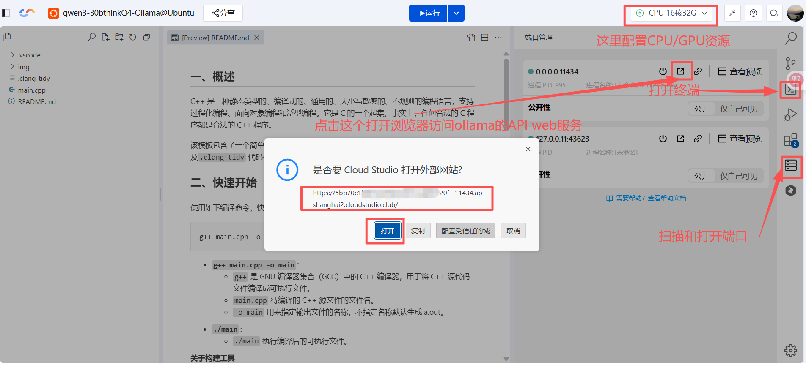
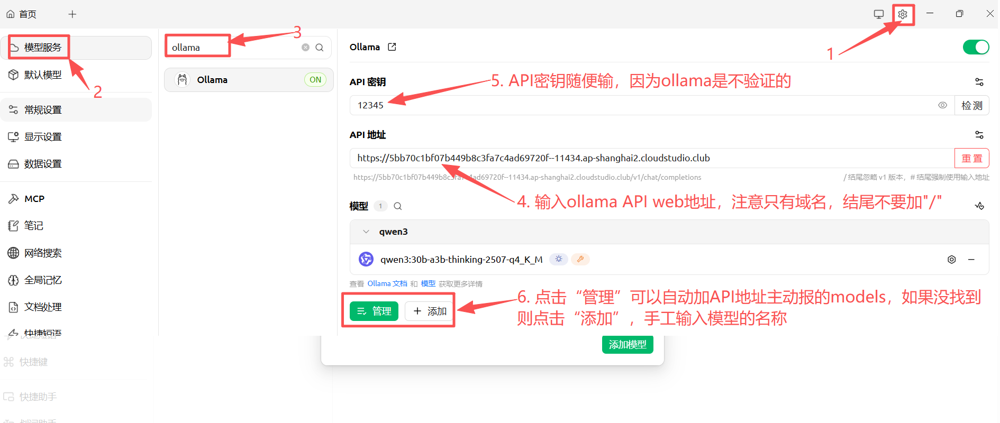

# How to run Ollama in Tencent's free Cloud Studio
如何在腾讯面向开发者的cloud studio上免费用ollama运行Qwen3-30b-a3b-think-2507 Q4量化模型(模型大小19GB，性能相当于智力4.275的GPT5非思考/Claude3.7Sonnet/Deepseek V3-0528模型)，并提供API Web接口给CherryStudio使用 

## 亮点
- 16C32G的CPU应用空间 达到20token/s！（比4060笔记本16G内存的联想Y7000p实测还快5t/s，该配置每天能薅1小时） 
- **20C116G + 24G显存A10的GPU应用空间 达到100tokens/s！！！（该配置每周能薅4+小时，甚至能运行qwen3:30b-a3b-thinking-2507-fp16（性能相当于智力4.375的GPT5mini/Claude4Opus/Gemini2.5Flash/DS R1，但Cloud Studio应用空间的硬盘都是50GB不满足fp16模型61GB的要求！）和 Qwen3-Next80b-a3b-Q8（至今未上线Ollama）模型），最新消息CloudStudio的CVM硬盘扩容到256GB了**  
- **20C116G + 24G显存A10的GPU应用空间 跑qwen3:30b-a3b-thinking-2507-fp16模型达到 13tokens/s，显存占用21.5G内存占用38G硬盘占用61GB，但似乎有点不稳定？？？

## 1. 在腾讯Cloud Studio上创建一个只有Ubuntu的应用并安装Ollama
[https://cloudstudio.net/my-app](https://cloudstudio.net/my-app)
### 1）创建应用，模板选Ubuntu，应用空间（类似云主机）内存选16C32G及以上CPU主机或者8C32G+16G显存T4主机
安装完成后，硬盘使用了~0.5GB 
**Tip: **
- **再次进入应用空间时，在“个人中心” - “应用管理” 里点击“继续编辑” ，这样进入应用空间后界面更友好！ **
### 2）打开终端，拉取 Ollama 官方镜像（如果未预装）：
**docker pull ollama/ollama **
安装完成后，硬盘使用了3.6GB 

## 2. 运行Ollama，并下载启用qwen3:30b-a3b-thinking-2507-q4_K_M 模型（从[ollama.com](https://ollama.com/library/qwen3/tags)得到模型的信息和名字）
### 1.1）如果应用空间没有GPU使用下面的命令启动ollama
**docker run -d \\ 
  -v ollama:/root/.ollama \\ 
  -p 11434:11434 \\ 
  --restart always \\ 
  ollama/ollama 
 **
此时内存使用了0.8G、硬盘使用了3.6GB 

### 1.2）如果应用空间有GPU，直接使用下面的命令启动ollama
**docker run -d --gpus=all \\ 
  -v ollama:/root/.ollama \\ 
  -p 11434:11434 \\ 
  --restart always \\ 
  ollama/ollama 
 **
**如果失败则是因为NVidia显卡在Docker这个Container中运行的关系，用以下方法解决**
Configure NVIDIA Container Runtime to bypass device filtering：A workaround documented in community reports involves telling the NVIDIA runtime to skip strict device cgroup enforcement by editing its config:
Edit or create the config file: 
 
**sudo mkdir -p /etc/nvidia-container-runtime **
**sudo nano /etc/nvidia-container-runtime/config.toml **
 
Add or ensure the following 2 lines are present: 
 
[nvidia-container-cli] 
**no-cgroups = true **
###The key setting is `no-cgroups = true`, which disables cgroup device rule enforcement and avoids the `bpf_prog_query` call . 
 
[nvidia-container-runtime] 
debug = "/tmp/nvidia-container-runtime.log" 
 
**用^x(按CTRL+X）退出编辑后再次运行ollama启动命令就OK了 **
sudo systemctl restart docker 
docker run -d --gpus=all\\ 
  -v ollama:/root/.ollama \\ 
  -p 11434:11434 \\ 
  --restart always \\ 
  ollama/ollama 
 
此时内存使用了0.8G、硬盘使用了3.6GB 
 
### 2）在Docker中下载并启用qwen3:30b-a3b-thinking-2507-q4_K_M 模型
查看容器 ID 或名称 
**docker ps     **
 
假设显示如下 
**/workspace git:(master) docker ps **
**CONTAINER ID**   IMAGE           COMMAND               CREATED          STATUS          PORTS                                           NAMES 
**dad073e1a5a7**   ollama/ollama   "/bin/ollama serve"   11 minutes ago   Up 11 minutes   0.0.0.0:11434->11434/tcp, :::11434->11434/tcp   kind_golick 
假设容器ID为 dad073e1a5a7(如上面运行的例子），运行下面的命令下载并启用qwen3:30b-a3b-thinking-2507-q4_K_M 模型，下载速度一般为20-40MB/s，该模型19GB大约10-15min完成 
 
**docker exec -it dad073e1a5a7 ollama run qwen3:30b-a3b-thinking-2507-q4_K_M --verbose **
在Ollama的CLI界面中可以进行对话了 
此时内存使用了20G、硬盘使用了22GB，如果有GPU的话GPU显存使用了18G（T4的话只有16G都占满），GPU占用率80% 

点击右边栏的端口管理（如下图所示）能打开Ollama的API Web服务，此时应显示Ollama is running 

**实测qwen3:30b-a3b-thinking-2507-q4_K_M 模型速度** 
**1）16C32G CPU应用空间 达到20token/s！（比4060笔记本16G内存的联想Y7000p实测还快5t/s，该配置每天能薅1小时） **
2）8C32G + 16G显存T4的GPU应用空间 达到30tokens/s（该配置每周能薅11+小时） 
**3）20C116G + 24G显存A10的GPU应用空间 达到100tokens/s！！！（该配置每周能薅4+小时） **

**Tips: **
1、有时应用空间异常关机后ollama模型所在的硬盘blob损坏后会造成ollama run 启用模型时失败，即时用docker stop <container ID> 后重启ollama也不行。通过docker logs -f <container ID>
能在log中发现是blob损坏所致 
这时就要用以下命令（其中dad073e1a5a7 替换成docker ps中ollama进程显示的container ID）来删掉所有已下载的模型缓存（仅模型文件，不影响别的东西），并重拉模型。 
docker exec -it dad073e1a5a7 sh -lc '\\   
  rm -rf /root/.ollama/models/blobs; \\   
  rm -rf /root/.ollama/models/manifests; \\   
  ollama pull qwen3:30b-a3b-thinking-2507-q4_K_M \\  
'  
docker exec -it dad073e1a5a7 ollama run qwen3:30b-a3b-thinking-2507-q4_K_M --verbose  
2、所以应用空间退出时最好主动先退出ollama run进程，然后docker stop <container ID>,再停止应用空间，最后等空间完全停止后再关闭浏览器的窗口！  
3、ollama由于是通过Docker容器安装的，所以实际目录不在/root/.ollama 或 /home/你的用户/.ollama，而是要通过如下方法找到真实的目录 
你之前运行容器时用了：-v ollama:/root/.ollama (这表示使用了一个名为 ollama 的 Docker volume) 
执行以下命令查看它的实际位置： 
docker volume inspect ollama 
输出类似： 
json 
[ 
    { 
        "Driver": "local", 
        "Mountpoint": "/var/lib/docker/volumes/ollama/_data", 
        "Name": "ollama", 
        ... 
    } 
] 
所以，Ollama 的完整目录在主机上的路径是：/var/lib/docker/volumes/ollama/_data ，在此目录下你会看到： 
+ models/：存放所有模型文件（GGUF） 
+ config.json、logs/ 等 

## 3. CherryStudio集成ollama API 服务
如下图所示，把刚刚打开的Ollama的API Web服务地址集成到CherryStudio的模型服务中。 

